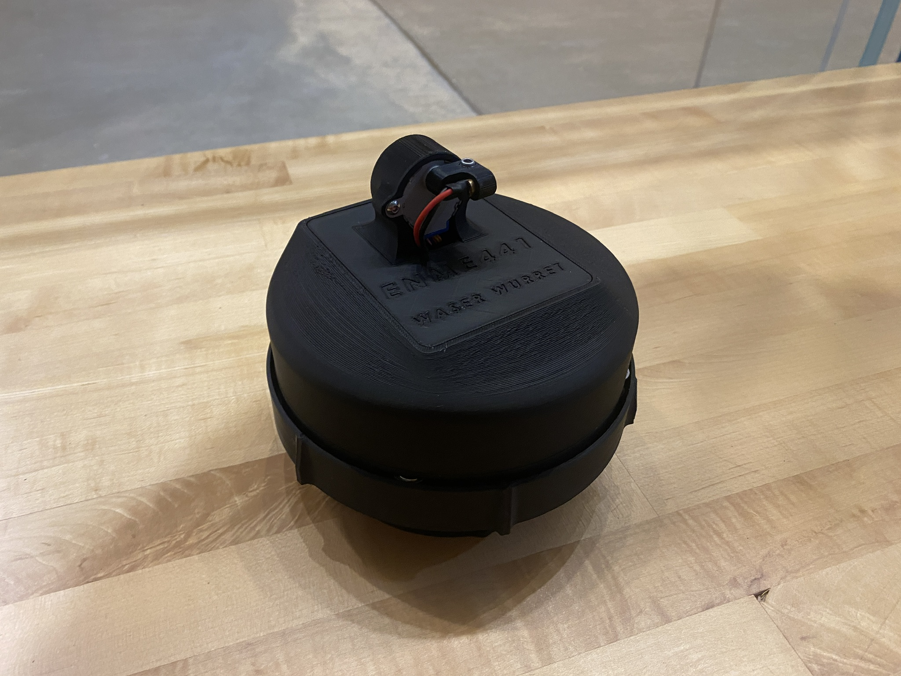

# Waser-Wurret
This was a project for my Mechatronics &amp; IoT class in which my partner and I developed and IoT laser turret that competed in a class competition. Our challenge was to design the hardware and software for a fully autonomous laser turret that could hit targets at specific coordinates accurately with a laser diode beam. My partner and I spent countless hours testing our software and fine tuning the control logic. However we were only able to hit 7 out of 13 targets during the phase 1 competition and 2 out of 4 for the phase 2 competition. We believe the issue was our calibration as the turret always went in the correct direction. There was also a smoke alarm incident that forced us to leave the building when our turret was able to hit 11 out of 13 targets accurately so we had lost our calibration.

---

## Phase 1 Sequential Targeting
In Phase 1, the challenge was to hit 13 targets sequentially based on coordinate data provided via an online JSON file. We designed a user interface using LLM tools, while the rest of the software was written entirely from scratch by my partner and me. To achieve precise targeting, we calculated azimuth and elevation angles and simultaneously controlled two stepper motors to drive the turret to each target. Additionally, we implemented features to calibrate and zero the stepper motors.

---

## Phase 2 Target ID Input
In Phase 2, we manually entered four target IDs into the web interface and hit those targets. This phase required filtering of the JSON data and used some of the code from Phase 1 to drive the motors to the targets.

---

## Hardware Design
Here is a picture of our actual turret:

Credit to my partner Alexander Wang for the exceptional hardware design.
[See his work here](https://alexwan9.myportfolio.com/waser-wurret-1)

## Web Interface
Here is a picture of our web interface:

Credit to Claude 3.5 LLM Model for the HTML and CSS code beind the web page.

